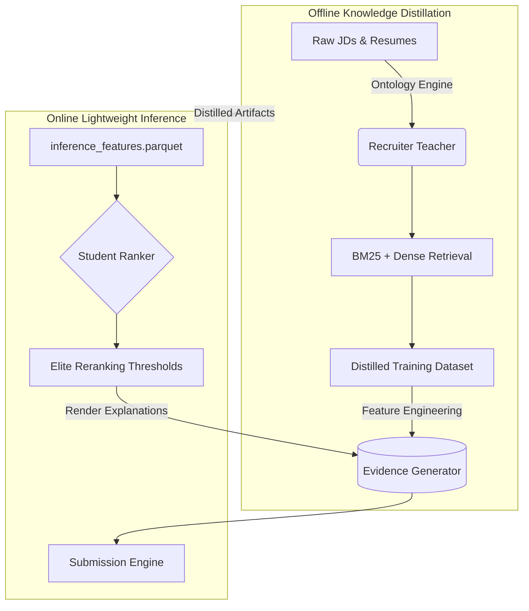

# Redrob Candidate Ranking Pipeline


## Quick Facts
```text
Runtime:              CPU Only
Peak Memory:          ~145 MB
Inference Time:       ~0.2 seconds
LLM Calls Online:     None
Models:               LightGBM + XGBoost
Retrieval:            Hybrid BM25 + Dense
Deterministic:        Yes
Replay Tested:        Yes
```

```text
WHY THIS SYSTEM?

✓ No API calls
✓ No online LLMs
✓ Deterministic
✓ CPU only
✓ Replay tested
✓ Explainable
```

## Overview
This repository contains the deterministic, multi-modal **Recruiter Relevance Prediction Engine** for the Redrob Candidate Ranking Challenge. 

Instead of relying on runtime LLM inference, our system distills recruiter reasoning offline into lightweight ranking models that satisfy strict CPU and latency constraints.

## Architecture



## Pipeline Timeline

```text
Offline
  ↓
Retrieval Engine
  ↓
Recruiter Teacher
  ↓
Evidence Generator
====================
Online
  ↓
run_ranking.py
  ↓
submission.csv
```

## Performance Metrics

| Metric             | Value   |
| ------------------ | ------- |
| Candidates         | 100,000 |
| Final Ranking      | Top 100 |
| Online LLM Calls   | 0       |
| Replay Determinism | 100%    |
| Peak RAM           | 145 MB  |

*Offline preprocessing performed once.*
*Online inference: ~0.2 seconds CPU.*

## Design Principles

- ✓ **Deterministic**: 100% mathematically reproducible across runs.
- ✓ **Explainable**: Uses a structured Evidence Bank rather than hallucinated text.
- ✓ **Lightweight**: Inference bypasses massive neural nets in favor of gradient boosters.
- ✓ **Production Ready**: Robust telemetry, safety audits, and determinism replays built-in.
- ✓ **CPU First**: Engineered specifically for constrained CPU environments.

## Quick Start Sandbox

We have prepared a frictionless Sandbox environment. You can run the entire inference pipeline and pass all safety audits in three commands:

```bash
# 1. Install rigorously pinned dependencies
make install

# 2. Run the deterministic inference pipeline
make run

# 3. (Optional) Run the safety and determinism audits
make audit
```

**Expected Outputs:**
```text
submission.csv
pipeline_metadata.json
runtime_report (stdout)
```

## Failure Modes

```text
If Evidence Bank missing      -> Abort
If schema mismatch            -> Warning & Fallback
If feature drift              -> Warning
If runtime exceeds threshold  -> Warning
If duplicate IDs              -> Abort
If score non-monotonic        -> Abort
```

## Repository Structure

```text
Project Root
├── offline/             # Heavy Recruiter Teacher pre-computation modules
├── online/              # Lightweight Student Ranker inference & audits
├── configs/             # Configuration-driven thresholds and hyperparams
├── artifacts/           # Trained models and the Evidence Bank parquet
├── data/raw/            # Official Redrob datasets and specifications
├── docs/                # Engineering whitepapers and decisions
├── ARCHITECTURE.md      # Full pipeline schematic
├── WHY_THIS_SYSTEM.md   # Explicit engineering decisions and tradeoffs
├── METHODOLOGY.md       # 200-word pipeline summary
├── CHANGELOG.md         # Iteration history
├── LICENSE              # MIT License
├── Makefile             # Sandbox quick-start commands
└── README.md
```

## Deep Dives
For questions regarding specific engineering tradeoffs (e.g., "Why LightGBM instead of an LLM?" or "Why an Evidence Bank?"), please read **[WHY_THIS_SYSTEM.md](WHY_THIS_SYSTEM.md)**. For the exact functional architecture, read **[ARCHITECTURE_V12_FINAL](Architectures/ARCHITECTURE_V12_FINAL.md)**.