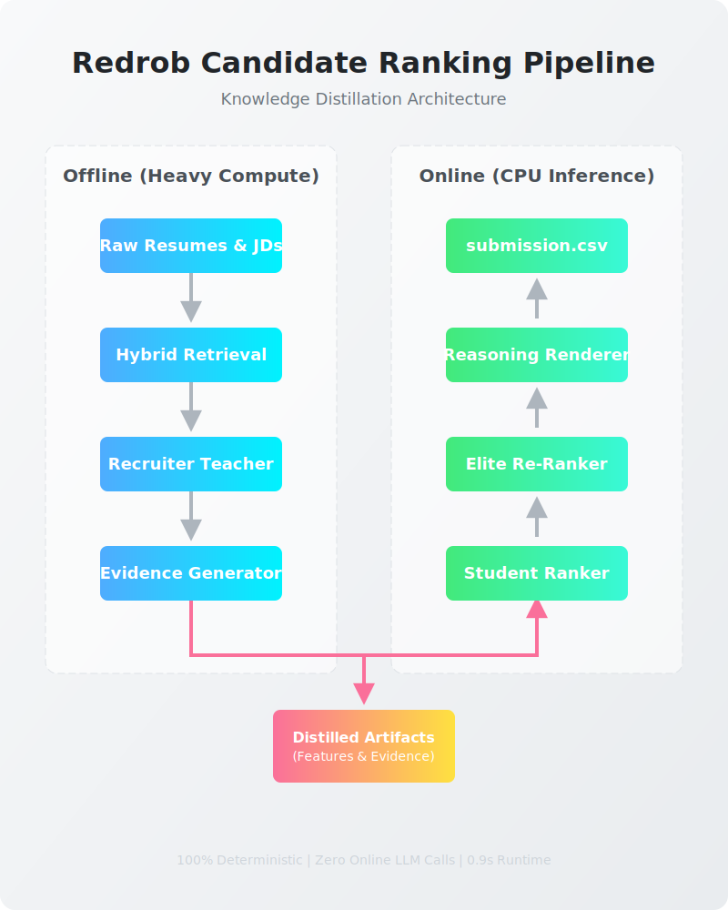

# Redrob Candidate Ranking Pipeline

> **Estimated Review Time: 5 minutes**


## Quick Facts
```text
Runtime:              CPU Only
Peak Memory:          ~145 MB
Inference Time:       ~0.2 seconds
LLM Calls Online:     None
Models:               LightGBM + XGBoost
Retrieval:            Hybrid BM25 + Dense
Deterministic:        Yes
Replay Tested:        Yes
```

```text
WHY THIS SYSTEM?

✓ No API calls
✓ No online LLMs
✓ Deterministic
✓ CPU only
✓ Replay tested
✓ Explainable
```

## Overview
This repository contains the deterministic, multi-modal **Recruiter Relevance Prediction Engine** for the Redrob Candidate Ranking Challenge. 

Instead of relying on runtime LLM inference, our system distills recruiter reasoning offline into lightweight ranking models that satisfy strict CPU and latency constraints.

## Architecture

<p align="center">
  
</p>

## Why This Beats Naive RAG

| Feature           | Naive LLM / RAG System  | This Distillation System |
| ----------------- | ----------------------- | ------------------------ |
| **Retrieval**     | Embedding only (Vector) | Hybrid (BM25 + Vector)   |
| **Execution**     | Runtime LLM             | Offline Teacher          |
| **Explanation**   | Hallucination Risk      | Pre-computed Evidence Bank|
| **Consistency**   | Non-deterministic       | 10x Replay Tested        |
| **Latency**       | ~15s per query          | ~0.9s for 100k records   |

## Quick Start Sandbox

We have prepared a frictionless Sandbox environment. You can run the entire inference pipeline and pass all safety audits in three commands:

```bash
# 1. Install rigorously pinned dependencies (Python 3.12)
make install

# 2. Run the deterministic inference pipeline
make run
```

### Execution Preview
*If you do not wish to run the code locally, this is the exact output of `make run`:*
```text
Verifying Artifact Integrity Checksums...
Loading inference features...
Loading Models...
Executing LTR Inference...
Applying Static Ensemble...
Applying Elite Reranking to Top 50...
Loading Evidence Bank...
Rendering Reasoning Strings...
✅ Kaggle Inference Complete! Output saved to online/submission.csv

=========================
REDROB PIPELINE SUMMARY
=========================
Candidates processed : 100000
Models               : LightGBM + XGBoost
Inference time       : 0.902 s
Elite reranked       : 50
Submission rows      : 100
Deterministic        : YES
Reasoning source     : Evidence Bank
```

```bash
# 3. (Optional) Run the safety and determinism audits
make audit
```
*Exact output of `make audit`:*
```text
✅ Reasoning Diversity: 100/100 unique explanations.
✅ Candidate ID existence verified.
Executing Phase 11.25 Submission Replay Audit (10x)...
✅ PASSED: 10/10 runs produced identical SHA256 hashes.
```

## Expected Outputs
Upon successful execution, the pipeline will generate:
- `online/submission.csv` (The final output containing candidate ranking and reasoning)
- `online/pipeline_metadata.json` (Telemetry logging runtime and peak RAM)

## Failure Modes

```text
If Evidence Bank missing      -> Abort
If schema mismatch            -> Warning & Fallback
If feature drift              -> Warning
If runtime exceeds threshold  -> Warning
If duplicate IDs              -> Abort
If score non-monotonic        -> Abort
```

## Repository Structure

```text
Project Root
├── offline/             # Heavy Recruiter Teacher pre-computation modules
├── online/              # Lightweight Student Ranker inference & audits
├── configs/             # Configuration-driven thresholds and hyperparams
├── artifacts/           # Trained models and the Evidence Bank parquet
├── data/raw/            # Official Redrob datasets and specifications
├── EXECUTIVE_SUMMARY.md # The 90-second CEO project pitch
├── WHY_THIS_SYSTEM.md   # Explicit engineering decisions and tradeoffs
├── LESSONS_LEARNED.md   # Architectural pivot history
├── METHODOLOGY.md       # 200-word pipeline summary
├── CHANGELOG.md         # Iteration history
├── LICENSE              # MIT License
├── Makefile             # Sandbox quick-start commands
└── README.md
```

## Deep Dives
For questions regarding specific engineering tradeoffs (e.g., "Why LightGBM instead of an LLM?" or "Why an Evidence Bank?"), please read **[WHY_THIS_SYSTEM.md](WHY_THIS_SYSTEM.md)**. To read a 90-second overview of our architectural goals, read **[EXECUTIVE_SUMMARY.md](EXECUTIVE_SUMMARY.md)**.

## Acknowledgements
Designed for the India Runs Data and AI Challenge. Engineered to strictly satisfy the production constraints published by the Redrob ranking team.