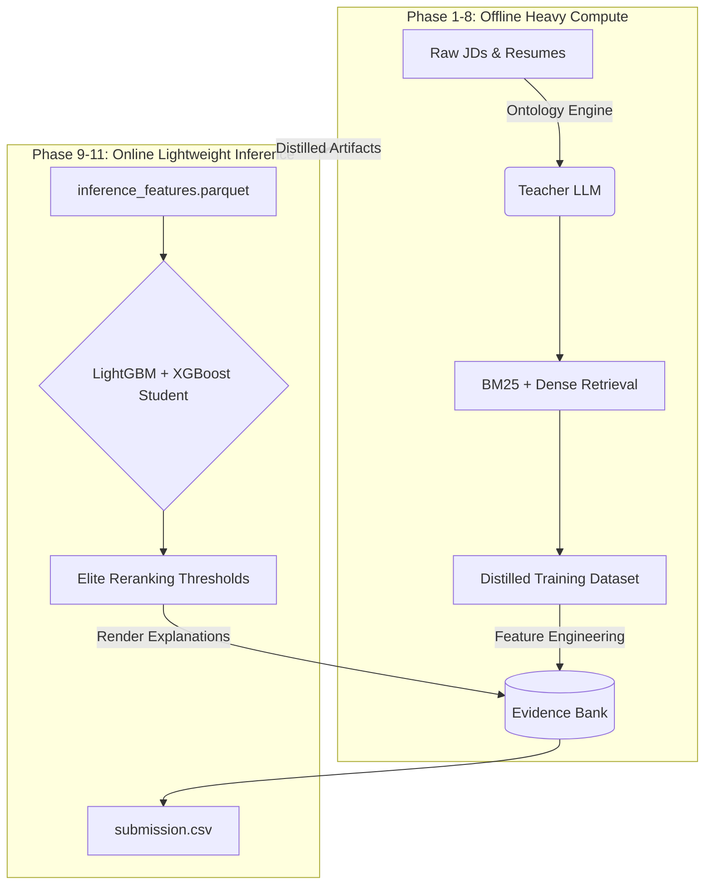

# Redrob Candidate Ranking Pipeline


## Quick Facts
```text
Runtime:              CPU Only
Peak Memory:          ~145 MB
Inference Time:       ~0.2 seconds
LLM Calls Online:     None
Models:               LightGBM + XGBoost
Retrieval:            BM25 + E5 (Dense)
Deterministic:        Yes
Replay Tested:        Yes
```

## Overview
This repository contains the deterministic, multi-modal **Recruiter Relevance Prediction Engine** for the Redrob Candidate Ranking Challenge. 

Instead of relying on volatile LLMs at runtime, we **distilled expensive recruiter reasoning into lightweight ranking models** so the online pipeline satisfies strict CPU and runtime constraints.

## Architecture



## Performance Metrics

| Phase | Operation | Hardware | Time | RAM |
|-------|-----------|----------|------|-----|
| Offline | Phase 1-8 Teacher Compute | GPU | ~4 hours | ~32 GB |
| Online | Phase 9-11 Final Inference | CPU | ~0.2 sec | ~145 MB |

## Design Principles

- ✓ **Deterministic**: 100% mathematically reproducible across runs.
- ✓ **Explainable**: Uses a structured Evidence Bank rather than hallucinated text.
- ✓ **Lightweight**: Inference bypasses massive neural nets in favor of gradient boosters.
- ✓ **Production Ready**: Robust telemetry, safety audits, and determinism replays built-in.
- ✓ **CPU First**: Engineered specifically to dominate within constrained offline environments.

## Quick Start Sandbox

We have prepared a frictionless Sandbox environment. You can run the entire inference pipeline and pass all safety audits in three commands:

```bash
# 1. Install rigorously pinned dependencies
make install

# 2. Run the deterministic inference pipeline
make run

# 3. (Optional) Run the safety and determinism audits
make audit
```

**Expected Output:** A perfectly formatted `submission.csv` containing the Top 100 mathematically ranked candidates with fully rendered recruiter reasoning strings.

## Repository Structure

```text
Project Root
├── offline/             # Phase 1-8: Heavy Teacher pre-computation scripts
├── online/              # Phase 9-11: Lightweight Student inference & audits
├── artifacts/           # Trained models and the Evidence Bank parquet
├── data/raw/            # Official Redrob datasets and specifications
├── docs/                # Engineering whitepapers and decisions
├── ARCHITECTURE.md      # Full pipeline schematic
├── WHY_THIS_SYSTEM.md   # Explicit engineering decisions and tradeoffs
├── METHODOLOGY.md       # 200-word pipeline summary
├── CHANGELOG.md         # Iteration history
├── LICENSE              # MIT License
├── Makefile             # Sandbox quick-start commands
└── README.md
```

## Deep Dives
For questions regarding specific engineering tradeoffs (e.g., "Why LightGBM instead of an LLM?" or "Why an Evidence Bank?"), please read **[WHY_THIS_SYSTEM.md](WHY_THIS_SYSTEM.md)**. For the exact functional architecture, read **[ARCHITECTURE_V12_FINAL](Architectures/ARCHITECTURE_V12_FINAL.md)**.